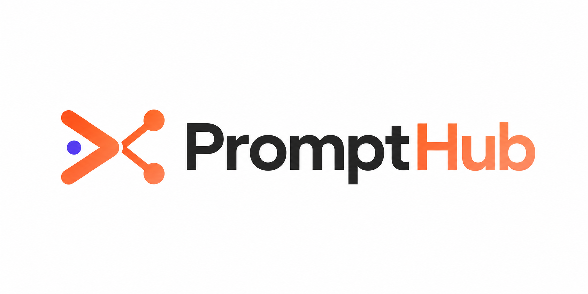

<div align="center">



# PromptHub

**A social platform to create, share, discover, and save AI prompts.**

[Live Demo](#) · [Report a Bug](https://github.com/SakibFakir69/prompthub-client/issues) · [Request a Feature](https://github.com/SakibFakir69/prompthub-client/issues)


</div>

---

## ✨ Features

- 🔐 **Authentication** — Register, login, OTP email verification, and password reset. Secure httpOnly cookie sessions with automatic silent token refresh.
- 📰 **Prompt Feed** — Personalized home feed of prompt cards with smooth skeleton loading states.
- 🔎 **Explore** — Browse and search prompts across the platform.
- ✍️ **Create Prompts** — Publish your own prompts with tags.
- 👥 **People** — Discover users, view profiles, and follow/unfollow.
- 👤 **Profile** — Manage your prompts (edit/delete), saved prompts, avatar upload, profile editing, password change, and stats.
- 📄 **Prompt Details** — Dedicated shareable page for every prompt.
- 🔔 **Push Notifications** — Real-time notifications via Firebase Cloud Messaging (foreground + background).
- ⚙️ **Settings** — Account and app preferences.
- 🚀 **Landing Page** — Hero, features, how-it-works, pricing, testimonials, and marketplace preview.

## 🛠 Tech Stack

| Category            | Technology                                                        |
| ------------------- | ----------------------------------------------------------------- |
| Framework           | [Next.js 16](https://nextjs.org) (App Router) + React 19          |
| Language            | TypeScript                                                        |
| Styling             | Tailwind CSS v4 + [shadcn/ui](https://ui.shadcn.com) (Radix UI)   |
| State & Data        | Redux Toolkit (RTK Query) with a custom Axios base query          |
| HTTP Client         | Axios (interceptor-based auth refresh)                            |
| Forms & Validation  | React Hook Form + Zod                                             |
| Push Notifications  | Firebase Cloud Messaging (FCM)                                    |
| Icons & UI          | Lucide React, React Toastify                                      |
| Tooling             | ESLint 9, Prettier 3                                              |

## 📁 Project Structure

```
src/
├── app/                      # Next.js App Router
│   ├── (auth)/               # login, register, otp, reset-email, reset-password
│   ├── (main)/               # home, explore, create, people, profile, settings
│   ├── prompt-details/[id]/  # public prompt detail page
│   └── verified/             # email verification landing
├── axios/                    # Axios instance + 401 refresh interceptor
├── store/                    # Redux Toolkit
│   ├── baseApi.ts            # RTK Query base API with cache tags
│   └── features/             # auth, otp, users, feed, prompt, explore, people, notification
├── components/               # Feature-organized UI components
├── validations/              # Zod schemas
├── lib/firebase.ts           # FCM initialization & token handling
├── helper/                   # Error handling, FCM token hook
└── constants/ interfaces/ types/ hooks/ context/ utils/
```

## 🚀 Getting Started

### Prerequisites

- Node.js 20+
- npm (or yarn / pnpm / bun)
- A running instance of the PromptHub backend API
- A [Firebase](https://console.firebase.google.com) project with Cloud Messaging enabled

### 1. Clone & Install

```bash
git clone https://github.com/SakibFakir69/prompthub-client.git
cd prompthub-client
npm install
```

### 2. Environment Variables

Create a `.env.local` file in the project root:

```env
# Backend API
NEXT_PUBLIC_BACKEND_URL=http://localhost:5000/api/v1

# Firebase Cloud Messaging
NEXT_PUBLIC_FIREBASE_API_KEY=your_firebase_api_key
NEXT_PUBLIC_FIREBASE_SENDER_ID=your_sender_id
NEXT_PUBLIC_FIREBASE_APP_ID=your_app_id
NEXT_PUBLIC_FIREBASE_VAPID_KEY=your_vapid_key
```

### 3. Run

```bash
# Development
npm run dev

# Production build
npm run build
npm start
```

Open [http://localhost:3000](http://localhost:3000) in your browser.

## 📜 Scripts

| Command         | Description                    |
| --------------- | ------------------------------ |
| `npm run dev`   | Start the development server   |
| `npm run build` | Create a production build      |
| `npm start`     | Serve the production build     |
| `npm run lint`  | Run ESLint                     |
| `npm run ptr-c` | Check formatting with Prettier |
| `npm run ptr-w` | Format code with Prettier      |

## 🏗 Architecture Highlights

- **Single RTK Query `baseApi`** with injected feature endpoints and tag-based cache invalidation (`Users`, `Feed`, `Prompt`, `SavedPrompt`, `People`, `Notification`, …).
- **Resilient auth flow** — every request carries credentials; on a `401`, the Axios interceptor calls `/auth/refresh` once, retries the original request, and redirects to `/login` only if refresh fails.
- **Route groups** cleanly separate the authenticated app `(main)` from the auth pages `(auth)`, each with its own layout.
- **Skeleton-first loading UX** — every data-driven view ships with a matching skeleton component.

## 🚢 Deployment

Deploy easily on [Vercel](https://vercel.com/new):

1. Import the repository into Vercel.
2. Add the environment variables listed above.
3. Deploy — Vercel handles builds and previews automatically.

> **Note:** Make sure `NEXT_PUBLIC_BACKEND_URL` points to your production API and the backend's CORS config allows the deployed origin with credentials.

## 🤝 Contributing

Contributions are welcome!

1. Fork the repository
2. Create your feature branch (`git checkout -b feat/amazing-feature`)
3. Commit your changes (`git commit -m "feat: add amazing feature"`)
4. Push to the branch (`git push origin feat/amazing-feature`)
5. Open a Pull Request

## 📄 License

This project is private. All rights reserved.

---

<div align="center">
Made with ❤️ by <a href="https://github.com/SakibFakir69">Sakib Fakir</a>
</div>
